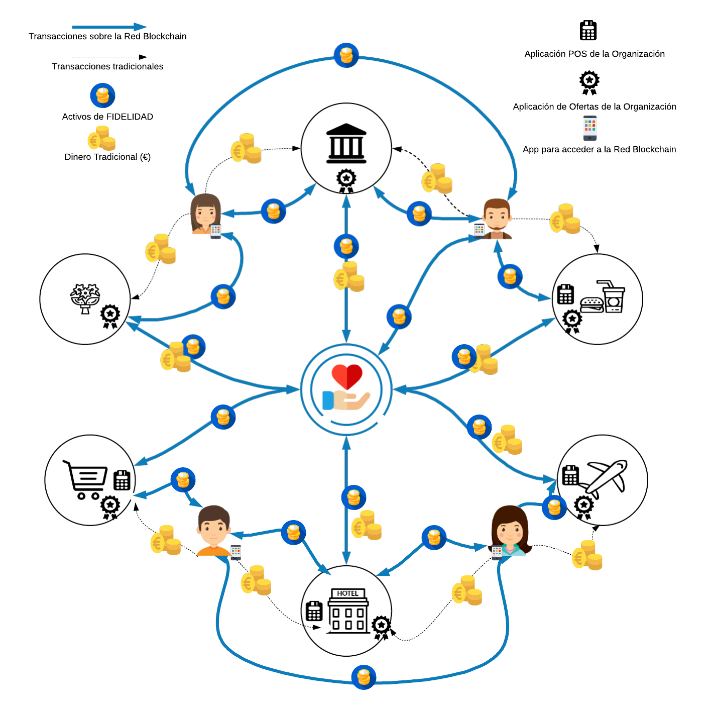

# Multi-Brand Loyalty Program based on blockchain
Author: Raúl Gonzalez Herrero <raul@gonzalezherrero.es>

A loyalty or loyalty program is a marketing strategy established by a company with the purpose of rewarding the purchasing behavior of its customers, which produces in them a sense of loyalty and loyalty to the brand or brands of that company. This type of programs offers, through the identification of the customer when making purchases, access to exclusive credits in store, discounts, prizes or any other type of benefit that manages to affirm its commitment to the brand.

Within the programs of Loyalty, there is a type of programs called Loyalty in Coalition or Loyalty multi-teaches, which consists in that a set of brands belonging to different sectors share a same loyalty program, in which the clients that participate in the they obtain rewards by making purchases in the different brands that make it up. The signs for obtaining "rights" are multiple, while the rewards program is unique.

This program will be based on digital assets - FIDECOIN (FIDC) - created for this purpose, which will represent the benefits granted to customers, and with which transactions will be carried out, and can be exchanged between partners and customers.

## System 
### Scheme

  

### Description
A private and permitted Blockchain system will be developed that allows the creation, assignment, redemption and exchange of "digital points" of loyalty between participating companies and customers, without the need for intermediaries and administrators of any kind.
**Note** The blockchain network will have multiple members and partners
### Members taking part on this system
* <u>Clients</u>: will be the people participating in the Loyalty program. Each customer will be identifiable through a Hash associated with their registration data.
* <u>Partners</u>: will be the companies participating in the Loyalty program, where customers can make purchases to obtain goods or services. Each partner will have, in turn, one or more sales establishments (physical or online) where contact with customers is made.
* <u>Loyalty Manager Consortium</u>: It will be the non-profit association formed by the organizations described above.
### Types of Transactions
* <u>Registry Transactions</u>:
   1. Registration of a participating organization in the Loyalty consortium (new member)
   * Registration of a retail establishment of the participating organization
   * Registration of customers who will participate in the system
* <u>Asset Transfer Transactions</u>:
   1. Sale of Loyalty assets, from the consortium to the partners, to be granted to their clients.
   * Purchase of Loyalty assets to the participating partners by the consortium
   * Delivery of Loyalty assets (Issue) to the clients by the partners, in the form of rewards, for purchases made in their sales establishments.
   * Collection of Loyalty assets (Redemption) of the Clients by the partners, which will represent discounts on purchases made.
   * Loyalty assets transfer between clients, directly.
## Required Components
* [Hyperledger Composer v0.20.2](https://hyperledger.github.io/composer/latest/) Hyperledger Composer is an extensive, open development toolset and framework to make developing blockchain applications easier
* [Hyperledger Fabric v1.4](https://hyperledger-fabric.readthedocs.io) Hyperledger Fabric is a platform for distributed ledger solutions, underpinned by a modular architecture delivering high degrees of confidentiality, resiliency, flexibility and scalability.
## Featured technology
+ [Visual Studio Code] (https://code.visualstudio.com/) Visual Studio Code is a lightweight but powerful source code editor which runs on your desktop and is available for Windows, macOS and Linux. It comes with built-in support for JavaScript, TypeScript and Node.js and has a rich ecosystem of extensions for other languages (such as C++, C#, Java, Python, PHP, Go) and runtimes (such as .NET and Unity)
+ [Nodejs](https://nodejs.org/) Node.js is an open-source, cross-platform JavaScript run-time environment that executes JavaScript code server-side
+ [Bootstrap](https://getbootstrap.com/) Bootstrap is an open source toolkit for developing with HTML, CSS, and JS